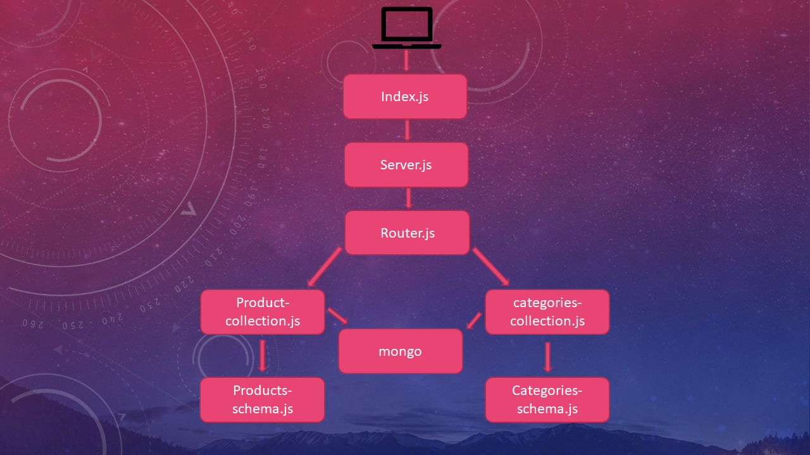

# authenticated-api-server

Implement a fully functional, authenticated and authorized API Server using the latest coding techniques
### Author: Osama Mousa
### Links and Resources

- [submission PR class-15](https://github.com/401-advanced-javascript-osama/authenticated-api-server/pull/1)

### Modules
#### `Node.js` 
### Packages
#### `express` , `bcryptjs` , `dotenv` , `jsonwebtoken` , `mongoose` , `morgan` 

#### How to initialize/run your application

- sign up then copy the token after that chose the bearer authorization from the header and past it thier then send you will get the user info

- after sign in copy the token and set it to the header `bearer authrization` and hit these routs :
- GET ALL: GET - http://localhost:3030/api/v1/categories
- GET ONE: GET - http://localhost:3030/api/v1/categories/1
- UPDATE ONE:  PUT - http://localhost:3030/api/v1/categories/1
- DELETE ONE: DELETE - http://localhost:3030/api/v1/categories/1
- GET ALL: GET - http://localhost:3030/api/v1/products
- GET ONE: GET - http://localhost:3030/api/v1/products/1
- UPDATE ONE:   PUT - http://localhost:3030/api/v1/products/1
- DELETE ONE: DELETE - http://localhost:3030/api/v1/products/1
-----------------
- GET ALL: GET - https://api-server-osama.herokuapp.com/api/v1/categories
- GET ONE: GET - https://api-server-osama.herokuapp.com/api/v1/categories/1
- UPDATE ONE:  PUT - https://api-server-osama.herokuapp.com/api/v1/categories/1
- DELETE ONE: DELETE - https://api-server-osama.herokuapp.com/api/v1/categories/1
- GET ALL: GET - https://api-server-osama.herokuapp.com/api/v1/products
- GET ONE: GET - https://api-server-osama.herokuapp.com/api/v1/products/1
- UPDATE ONE:   PUT - https://api-server-osama.herokuapp.com/api/v1/products/1
- DELETE ONE: DELETE - https://api-server-osama.herokuapp.com/api/v1/products/1

#### Tests

- check mongoose database to see the record

#### UML

